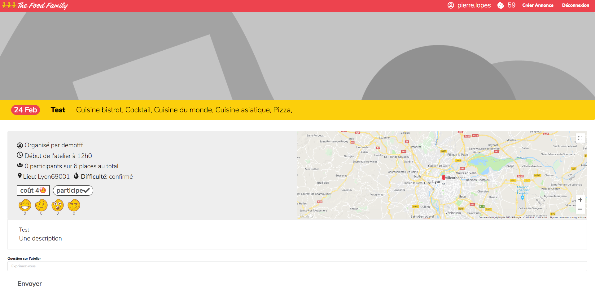

# food-family

Projet de fin de formation realisé avec 2 autres étudiants. The Food Family est un site communautaire centré sur le thème de la cuisine. L’objectif est de mettre en relation des particuliers dans l'organisation d'atelier de cuisine.

## Technos utilisées :

### React
- Centralisation des données : React-Redux
- Routage : React-Router
- Authentification : JWT-decode
- Carte : Google-map-react 
- Les appels API : Axios
- Style UI : Semantic-UI

### Symfony

- Authentifcation : Lexik JWT Token
- Interface avec la base de données : ORM Doctrine
- Base de données : Myslq
- Gestion de base de données : PhpMyAdmin
- Gestion du preflight des requetes axios : Nelmio Cors bundle
- Generation de faux contenu : Faker
- Api doc : Nelmio
- Permet la génération et l’envoi d’email: Swiftmailer Bundle
- Permet de créer le slug d’un propriété de l’entité (name, title...) : Cocur Slugify Bundle

